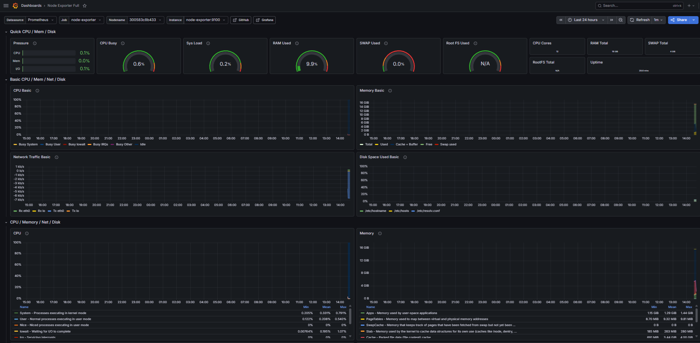
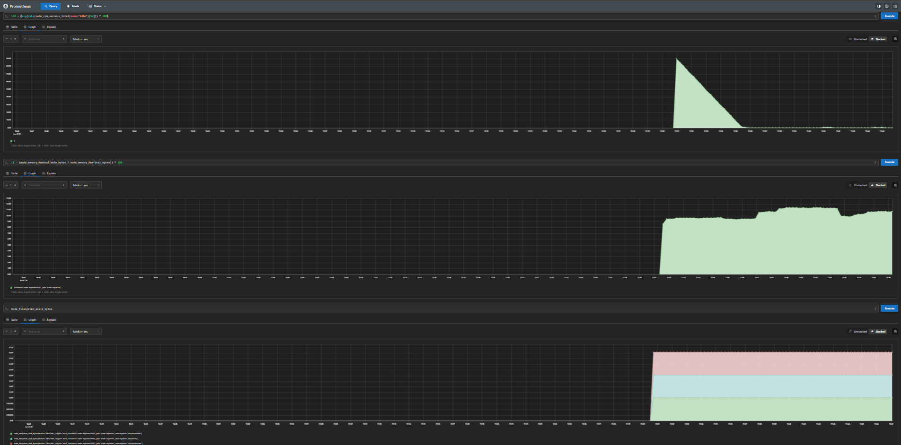

# 🔭 observability-homelab

> Full monitoring and observability stack running locally with Docker Compose.  
> Study and portfolio project — built to demonstrate real SRE and Observability practices.


---

## 🧱 Architecture

```
┌─────────────────────────────────────────────────┐
│                   Docker Host                   │
│                                                 │
│  ┌─────────────┐     ┌─────────────────────┐   │
│  │  Prometheus │────▶│    Alertmanager      │   │
│  │  :9090      │     │    :9093             │   │
│  └──────┬──────┘     └──────────┬──────────┘   │
│         │scrape                 │notify         │
│  ┌──────▼──────┐         ┌──────▼──────┐        │
│  │Node Exporter│         │    Slack    │        │
│  │  :9100      │         │  #alerts   │        │
│  └─────────────┘         └─────────────┘        │
│                                                 │
│  ┌─────────────┐     ┌─────────────────────┐   │
│  │   Grafana   │────▶│  Prometheus (source)│   │
│  │   :3000     │     └─────────────────────┘   │
│  └─────────────┘                               │
│                                                 │
│  ┌─────────────┐  ┌──────────┐  ┌──────────┐  │
│  │Zabbix Server│─▶│ MySQL DB │  │Zabbix Web│  │
│  │  :10051     │  │          │  │  :8080   │  │
│  └─────────────┘  └──────────┘  └──────────┘  │
└─────────────────────────────────────────────────┘
```

## 📸 Screenshots




## 🛠️ Stack

| Tool | Function | Port |
|---|---|---|
| Prometheus | Metrics collection and storage | 9090 |
| Node Exporter | Exports host metrics (CPU, memory, disk) | 9100 |
| Grafana | Visualization and dashboards | 3000 |
| Alertmanager | Alert management and routing | 9093 |
| Zabbix Server | Infrastructure monitoring | 10051 |
| Zabbix Web | Zabbix web interface | 8080 |

---

## 🚀 How to run

### Prerequisites
- [Docker Desktop](https://www.docker.com/products/docker-desktop/) installed
- Git installed

### 1. Clone the repository
```bash
git clone https://github.com/biagasparino/observability-homelab.git
cd observability-homelab
```

### 2. Configure Alertmanager (optional)
Edit `alertmanager/alertmanager.yml` and add your Slack webhook:
```yaml
api_url: "https://hooks.slack.com/services/YOUR/WEBHOOK/HERE"
```

### 3. Start the environment
```bash
docker compose up -d
```

### 4. Access the services

| Service | URL | Login |
|---|---|---|
| Grafana | http://localhost:3000 | admin / admin123 |
| Prometheus | http://localhost:9090 | — |
| Alertmanager | http://localhost:9093 | — |
| Zabbix Web | http://localhost:8080 | Admin / zabbix |

---

## 📊 Configured Alerts

| Alert | Condition | Severity |
|---|---|---|
| HostDown | Target unresponsive for 1min | 🔴 Critical |
| HighCPUUsage | CPU > 85% for 5min | 🟡 Warning |
| HighMemoryUsage | Memory > 90% for 5min | 🟡 Warning |
| DiskSpaceLow | Disk < 15% available | 🔴 Critical |

---

## 📁 Project structure

```
observability-homelab/
├── docker-compose.yml
├── prometheus/
│   ├── prometheus.yml       # Scrape config and rules
│   └── alerts.yml           # Alert rules
├── grafana/
│   ├── provisioning/
│   │   ├── datasources/     # Prometheus as default datasource
│   │   └── dashboards/      # Automatic dashboard provisioning
│   └── dashboards/          # Dashboard JSON files
├── alertmanager/
│   └── alertmanager.yml     # Alert routing (Slack)
└── zabbix/
```

---

## 📌 Next steps

- [ ] Add Loki for log collection
- [ ] Create SLO/SLI dashboard in Grafana
- [ ] Add Python script for alert reporting
- [ ] Integrate Blackbox Exporter for HTTP endpoint monitoring

---

## 👩‍💻 Author

**Bianca Gasparino de Campos**  
Observability & SRE Engineer  
[LinkedIn](https://www.linkedin.com/in/bianca-gasparino/) · [GitHub](https://github.com/biagasparino)
